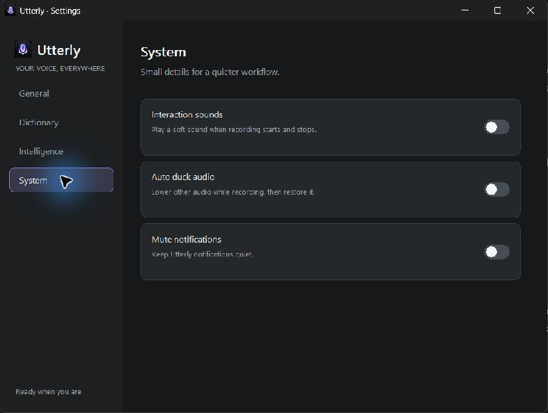
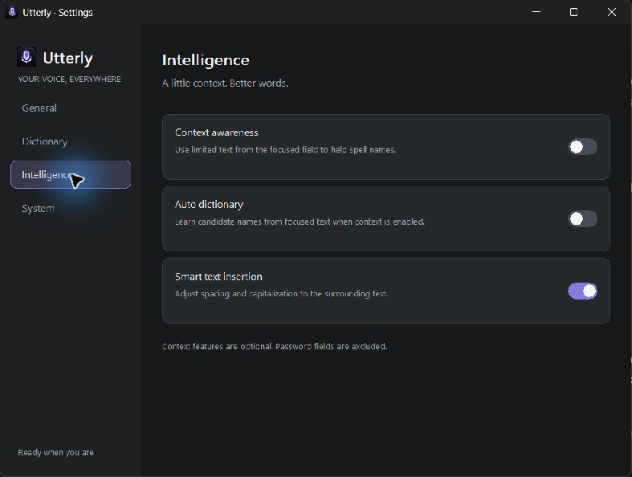

# Utterly


Native Rust push-to-talk dictation for Windows, macOS, and Linux. Utterly
streams microphone audio to Gemini Live and shows the revisable transcript as
you speak.

## Quick start

1. Create an API key in [Google AI Studio](https://aistudio.google.com/apikey).
2. Copy it, then right-click the tray icon and choose **Paste API key from
   clipboard**, or run `utterly --set-key`.
3. Click a text field, hold the shortcut, speak, and release.

New Windows configurations use **Ctrl+Win**. Releasing either modifier stops
recording. Existing saved shortcuts remain in place, and the other presets
(Alt+Space, Ctrl+Space, Ctrl+Shift+Space) remain available. macOS and Linux
default to Alt+Space.

The small idle handle sits above the active display's taskbar. While recording,
the native pill shows the focused app icon, microphone waveform, and a compact
live transcript pill; after release it collapses while Gemini finishes the
final transcript. On Windows, Utterly pastes only into the same editable
target captured at recording start; if that target is unavailable or changes,
the transcript stays on the clipboard. macOS and Linux retain their existing
platform paste behavior. Use the tray menu to open Settings or quit. On
Windows, drag the pill to reposition it when automatic positioning is off.

First-run notes: on macOS, right-click → Open the app once (unsigned build),
then grant Microphone + Accessibility. On Windows, allow microphone access.
On Linux, a system tray (AppIndicator) is needed for the menu.

## Transcription

Utterly uses Google's **Gemini 3.5 Transcribe Live** (`gemini-3.5-transcribe-live`)
over a WebSocket; the model runs remotely, with no model download in the app.
Smart mode removes disfluencies, repairs self-corrections, and formats text.
Verbatim mode keeps the spoken words. Usage depends on the Google AI Studio
quota and billing terms for your account.

## Settings

The Windows Settings window uses native Win32 controls and a dark charcoal,
gray, and violet palette. Its General, Dictionary, Intelligence, and System
pages keep the existing microphone, Smart/Verbatim, shortcut, vocabulary, and
API-key controls together with pill and recording preferences.

The preferences include optional recording cues, Windows audio ducking with
restoration, automatic active-display positioning, the idle handle, hiding the
focused-app icon, and muting Utterly's temporary pill notices. **Mute
notifications applies to Utterly's own pill notices; it does not change
Windows notification settings.** On Windows, Smart Text Insertion uses limited
caret text to adjust spacing and capitalization. Context Awareness can add
candidate names from that text to the current Gemini session. Auto Dictionary
stores conservative candidate names in the local vocabulary. These text-based
options are off by default, except Smart Text Insertion, which is on.

Custom vocabulary is saved locally and sent to Gemini with a transcription
session to improve recognition. It is limited to 1,000 phrases. When a
text-based option needs context, Utterly reads at most 160 characters on each
side of the caret in the focused editable field. It does not scan the whole
screen, and it skips password and read-only controls. With Context Awareness
enabled, selected candidate names are sent as vocabulary with that session.
Audio is also sent to Google for transcription; review the terms for your
account tier. The API key is protected with Windows DPAPI and the config file
is restricted to the current user on Unix.

Config is stored as JSON (`~/.config/utterly/`, `%APPDATA%\Utterly` on
Windows). CLI options include `--list-mics`, `--set-mic`, `--set-hotkey`,
`--set-mode`, and `--set-key`. Run `utterly --settings` to open the native
Windows Settings window at launch. Copy the key before running `--set-key`
because command-line arguments can expose secrets to other processes.

## Design and assets

The native interface follows the supplied Willow references while retaining
Utterly's identity. `icon.png` is the original app icon; `scripts/prepare-icon.py`
derives the runtime PNG, tray pixels, and Windows ICO. Recording sounds are
original generated tones from `scripts/prepare-sounds.py`, not Willow audio.
The Willow research report links the source manifests and records which files
are references rather than shipped app assets: [research and asset report](docs/willow-research.md),
[asset manifest](docs/references/manifest.json), and
[web and embedded asset manifest](docs/references/web-and-embedded-manifest.json).

## Build

Requires stable Rust and the platform's microphone/tray libraries (Linux:
`libasound2-dev libxkbcommon-dev libgtk-3-dev libayatana-appindicator3-dev`).

```sh
cargo check
cargo test --all-targets
cargo build --release
```

Windows and macOS build from the same tree (`winit`, `cpal`, tray, hotkeys,
and clipboard all have native backends; Linux-only code is `cfg`-gated).
Tagged `v*` pushes build the release binaries automatically via GitHub Actions.

## Screenshots

Generated native renderer preview (idle handle, recording capsule, live
transcript, and processing indicator; this is not a live-app screenshot):


The Settings images are from the running Windows app:




The following captured screenshots show the earlier compact layout:


The Windows ICO is generated from `icon.png` and included with the release
files for app shortcuts and file associations.
