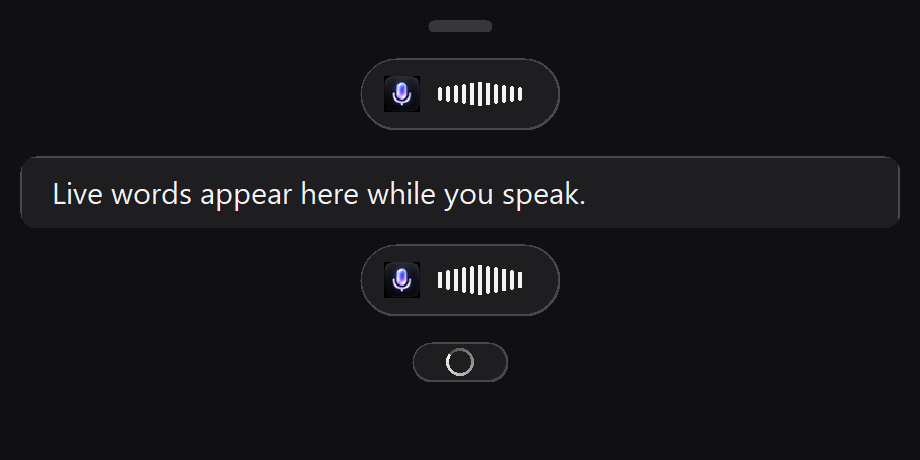

# Willow-inspired native UI QA

Status recorded 24 September 2026. This report separates code review, automated
checks, and hands-on checks; passing a unit test does not establish that the
Windows interface or audio effects were visually or physically tested.



This image is produced by the ignored renderer-preview test; it shows the
idle handle, recording capsule, transcript surface, and processing indicator.
It was generated after the idle handle was set to 32 × 6 logical pixels. It is
not a screenshot of the running Windows app.

## Implementation reviewed

- Windows Settings is a dark native Win32 window with General, Dictionary,
  Intelligence, and System pages. The pill uses a 32 × 6 logical-pixel idle
  handle (about 40 × 8 physical px at 125% scale), a 100 × 36 recording
  capsule, an expanded live transcript surface, and a compact finalizing
  indicator.
- New Windows configurations use Ctrl+Win; either modifier release ends the
  take. Saved shortcut values are retained, and Alt+Space, Ctrl+Space, and
  Ctrl+Shift+Space remain selectable. macOS/Linux default to Alt+Space.
- The supplied `icon.png` is the source for the runtime app, tray, and Windows
  icons. Recording cues are original generated tones, not copied Willow audio.
- Interaction cues, optional Windows audio ducking/restoration, active-display
  positioning, idle-handle visibility, focused-app icon visibility, and
  suppressing Utterly's temporary pill notices are wired to preferences.
  “Mute notifications” does not change Windows notification settings.
- Context, Auto Dictionary, and Smart Text Insertion are wired. Windows reads
  limited caret context only for those enabled behaviors: at most 160
  characters on each side of the insertion point. It rejects password,
  disabled, read-only, and non-editable controls. Context Awareness uses
  candidate names as session-specific Gemini vocabulary; Auto Dictionary
  stores conservative candidates in the local vocabulary. Smart insertion
  adjusts case and spacing from nearby text. If the original editable target
  is unavailable or changes, the result stays on the clipboard instead of
  being pasted into a different window.
- The UIA capture is Windows-specific. macOS/Linux do not currently provide
  equivalent focused-control context through this implementation.

## Automated checks

These command results reflect the source after the Settings paint, navigation
redraw, and UI Automation timeout updates.

| Check | Result |
| --- | --- |
| `cargo check` | Passed on the final source tree. |
| `cargo test --all-targets -- --test-threads=1` | Passed: 61 passed, 0 failed, 6 ignored. Three network tests, the native focus and audio tests, and the renderer preview are explicitly ignored by default. |
| `cargo test output::tests::native_focus_and_paste_smoke -- --ignored --exact --nocapture --test-threads=1` | Passed: 1 passed in 1.60 s with `UTTERLY_FOCUS_TEST_INTERACTIVE=1`; it inserted into a real editable target and checked changed-focus and password fallback. |
| `cargo test ui::tests::render_preview -- --ignored --exact --nocapture --test-threads=1` | Passed: 1 passed. Generated the current `pill-render-preview.png` from the PPM output with Pillow. |
| `system::tests::native_audio_duck_and_restore` (explicit Windows fixture; ignored by default) | Passed. Changed and restored two other audio-session scalar volumes with recording cues disabled; this is not a subjective sound check. |
| `cargo fmt --all` and `cargo fmt --all -- --check` | Passed. |
| `cargo clippy --all-targets -- -D warnings` | Passed after replacing fixed-size `chunks_exact` loops with array chunks. |
| `cargo build --release` | Passed. Windows EXE: 1,717,248 bytes (1.638 MiB). Portable ZIP: 1,073,407 bytes. |
| `python scripts/prepare-sounds.py` | Passed. Wrote and self-checked both generated WAVs. Each is 4,012 bytes, mono, 22,050 Hz, 16-bit PCM, 90 ms. |

An explicit live speech-to-text test also passed:

```powershell
$env:UTTERLY_TEST_PCM = "target/hello_are_you_there.pcm"
cargo test transcribe::tests::test_live_speech_audio_transcription -- --ignored --exact --nocapture --test-threads=1
```

It used `UTTERLY_TEST_PCM=target/hello_are_you_there.pcm`, Google's public
96,938-byte PCM sample. Gemini returned two interim updates and the final
transcript `Hey, can you hear me?`; the test completed in 2.47 seconds. This
confirms the live Gemini path with the public sample, not a physical microphone
or the supplied user recording. Three network-dependent tests are now ignored
by default so an ordinary suite run does not consume API quota.

The automated tests exercise hotkey state transitions, focus-target identity,
dictionary candidates, smart insertion, preference persistence, transcript
rendering logic, and audio-volume restore decisions. Native Windows capture
code filters password, disabled, read-only, and non-editable controls. The
standard suite does not exercise those paths against live application
controls. Unit tests also cannot establish how polished the running window
feels.

A native Windows insertion fixture passed after the cold-query timeout was
increased from 100 to 250 ms with up to two retries on the specific timeout. It inserted into a real
editable target, kept text clipboard-only after focus changed, and rejected a
password control. The first cold query had exceeded the old timeout.

## Hands-on evidence and limits

The earlier baseline run reported 48 passed and 2 failed. The Windows hotkey
release race was subsequently fixed. A separate isolated microphone retest
then streamed 6 chunks over 600 ms successfully. These are prior-run results,
separate from the final 61-passed test run above.

During live Settings use, the Interaction Sounds toggle was switched on by
mouse and off with Space, and both values persisted to an isolated QA profile.
Adding `UtterlyTestName` in Dictionary made the term visible in the list and
saved it to that isolated profile. The Windows audio-effects test set and
restored session volumes for two other audio sessions with recording cues
disabled; this verifies COM session scalar changes, not the sound heard by a
listener.

The final live visual recheck confirmed the rounded-button corners are clean
and only the selected nav page stays highlighted when switching from System to
Intelligence. Native combo-box arrows in General remain light colored; the
window background and other controls use the dark theme. See the
[live System page](settings-system-live.jpg) and
[live Intelligence page](settings-intelligence-live.jpg). The renderer preview
above is separate from those running-app screenshots.

During a 10-second combined idle-pill, Settings-open, and microphone-capture
sample on an isolated offline QA profile, the app used 5.04 MiB private memory,
25.95 MiB working set, and 4.062% of one CPU core. The EXE and portable ZIP
sizes are recorded above. Raw measurements are in the
[metrics JSON](willow-native-metrics.json); the ZIP checksum is in the
[package manifest](utterly-windows-native-package.json). These measurements do
not describe active transcription CPU or speech-service latency.

Physical Ctrl+Win hold/release and mixed-DPI multi-monitor movement were not
manually exercised. The Windows focused-control fixture covered its temporary
editable field, changed-focus fallback, and password exclusion, not broad
compatibility across third-party applications. The pill image above remains a
renderer preview, not a live-app screenshot. The 23 September benchmark covers
the earlier 252 × 48 pill/settings design only:
[historical benchmark](../benchmarks/windows-11-2026-09-23.md).

## Asset and source reports

- Original application artwork: [`icon.png`](../../icon.png)
- Icon derivative generator: [`prepare-icon.py`](../../scripts/prepare-icon.py)
- Original recording cue generator: [`prepare-sounds.py`](../../scripts/prepare-sounds.py)
- Generated recording cues: [`record-start.wav`](../../assets/record-start.wav), [`record-stop.wav`](../../assets/record-stop.wav)
- Willow research, provenance, measurements, and reuse notes: [research report](../willow-research.md)
- Packaged-reference provenance: [local manifest](../references/manifest.json), [web and embedded manifest](../references/web-and-embedded-manifest.json)

The reference collection under `docs/references/` is kept for research and
comparison. It is not linked into the application build. Utterly ships its own
icon and original recording tones. Release CI reports the portable package
size as an informational measurement on every platform; no size cap or RAM
limit is enforced, and the Linux UPX pass and 5 MB size gate were removed.

> 2026-10-01: the measurements above were taken with the size-optimized
> (`opt-level = "z"`) build. The release profile now uses full speed
> optimization (`opt-level = 3`, fat LTO); re-run the benchmark scripts for
> current figures.
